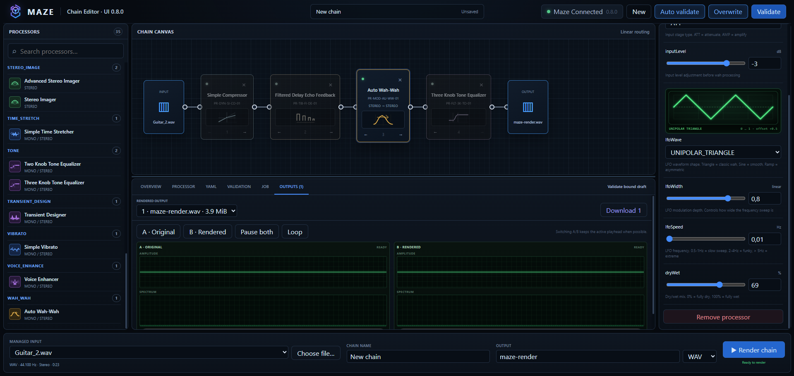

# MazeUI

Local visual chain editor for the Maze DSP engine.

MazeUI is a Vue 3 single-page application. Maze remains the authority for the processor catalog,
chain validation, DSP rendering, jobs, logs, and outputs. MazeAI is intentionally outside the first
implementation phase.

## Interface preview

The following screenshot is an example of the MazeUI graphical interface. The exact layout and
available controls may evolve with the processor catalog and ongoing UI work.



## Current workflow

- Vue 3, TypeScript, Vite, Pinia, and Vue Router
- typed client for Maze REST health, catalog, managed audio, validation, render, jobs, logs, and media
- processor catalog loaded from `GET /api/processors`
- managed WAV/AIFF selection and browser upload without server path fields
- strictly linear chain draft with bound inline YAML serialization
- mono/stereo topology checks driven by catalog `inputTypes` and `outputType`
- source-bound and regional parameter preservation, with source fingerprints populated from the
  selected managed input
- metadata-driven processor Inspector with source-derived fields locked read-only
- characteristic vector glyphs for every processor type in the distributed Maze catalog
- static green-phosphor waveform preview for every `lfoWave` parameter
- authoritative bound validation before render, either manual or through the debounced
  `Auto validate` toggle
- explicit `Overwrite` toggle for replacing an existing regular output under the same name
- asynchronous job status/log polling, cancellation/deletion, ordered outputs, playback, A/B,
  live amplitude/spectrum views, RMS/sample-peak meters, and explicit downloads
- dark studio shell based on the approved MazeUI direction
- Vue Flow dependency reserved for the constrained visual canvas integration

Maze remains authoritative for validation and rendering. The Render button is enabled only when the
current managed input/output bindings, topology, source provenance, and latest server validation are
acceptable. Jobs are intentionally session-local; the UI does not imply persistent server history.

## Requirements

- Node.js 20.19 or newer; Node.js 24 LTS is recommended
- Maze REST running locally (default development target: `http://127.0.0.1:8081`)

Dependencies are locked in `package-lock.json`; `node_modules` remains local and is not committed.

## IntelliJ IDEA

Open this directory directly:

```text
C:\Work\Projects\IDEA\com-qosmomodular-mazeui
```

Configure a local Node.js runtime in IntelliJ, then run:

```powershell
npm ci
npm run dev
```

The development UI listens on `http://127.0.0.1:5173` and proxies `/api` to Maze REST.

## Local end-to-end trial

Build and start Maze REST from its `main` worktree:

```powershell
cd C:\Work\Projects\IDEA\com-qosmomodular-maze
mvn clean package
java -jar maze-rest\target\maze-rest.jar --port 8081
```

In a second terminal, start MazeUI from its canonical project directory:

```powershell
cd C:\Work\Projects\IDEA\com-qosmomodular-mazeui
npm.cmd run dev
```

Open `http://127.0.0.1:5173`, select or upload a WAV/AIFF, add a compatible processor, choose a safe
output base name, validate the bound draft manually or enable `Auto validate`, and render. Completed
outputs appear in order with original/rendered playback, A/B controls, and download actions. Keep
`Overwrite` enabled to reuse the same output name while tuning processor parameters.

## Commands

```powershell
npm run dev
npm run typecheck
npm test
npm run build
```

## Configuration

Copy `.env.example` to `.env.local` only when the defaults are unsuitable:

```properties
VITE_MAZE_PROXY_TARGET=http://127.0.0.1:8081
VITE_MAZE_API_URL=/api
```

Keep `VITE_MAZE_API_URL=/api` for same-origin production packaging. No secret or provider credential
belongs in this browser application.

MazeAI is intentionally not called by this browser build. A future integration requires its own
server-side asynchronous proposal API so provider credentials, local audio resolution, and model
execution never move into the browser; Maze will remain the final validation and render authority.

## Version

0.8.0
